
# Instalación y configuración Servidor DNS

## Instalar servido DNS

primero pondremos una ip fija a nuestro server, para ello modificaremos el siguiente archivo

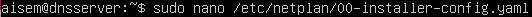

y le daremos al server una ip a nuestra elección 

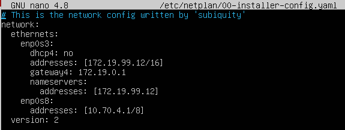

luego ejecutaremos el siguiente comando para aplicar los cambios

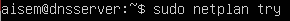

una vez echo esto solo nos quedará instalar bind 9

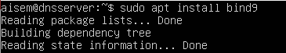

## Configurar el Cliente

primero configuraremos la ip de nuestro cliente para ello iremos a la configuración de redes

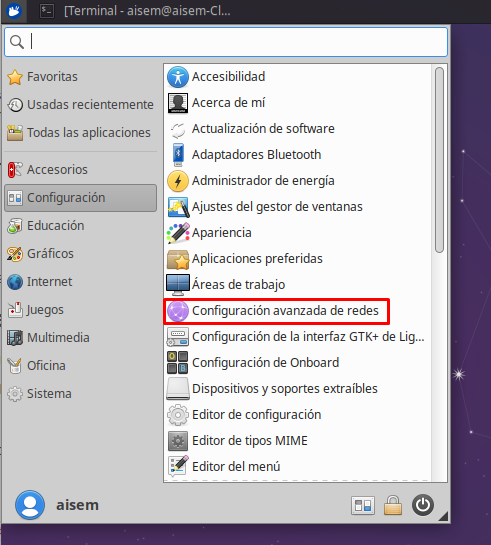

luego elegiremos la conexión que queremos modificar y clicaremos en la rueda dentada

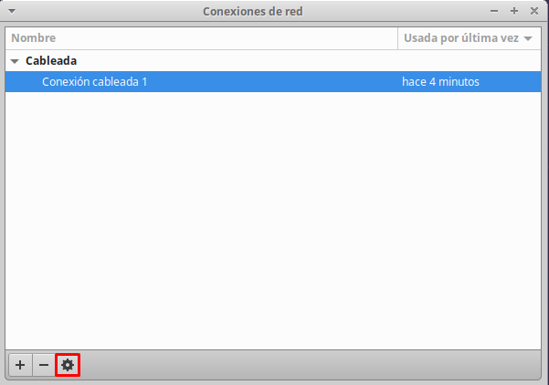

a continuación iremos a ajustes ipv4 y clicaremos en añadir, para poner la ip que utilizaremos en nuestro equipo, una vez finalizado le daremos a guardar y reiniciaremos el equipo

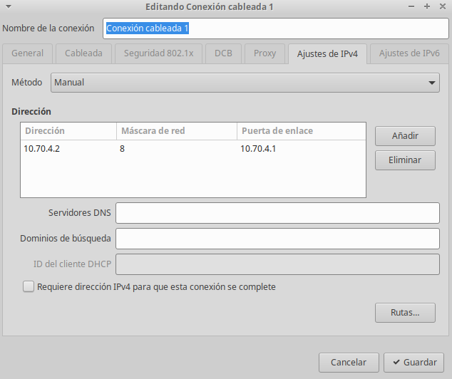

**fichero etc/nsswitch.conf**

este fichero sirve para determinar el orden de las búsquedas DNS

**Resolución del host**

para cambiar la resolución del host tendremos que modificar en archivo /etc/resolv.conf, para que el cambio sea permanenete tendremos que instalar resolvconf

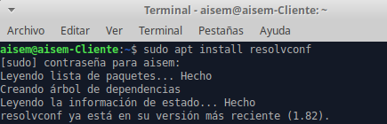

una vez instalado modificaremos el archivo /etc/resolvconf/resolv.conf.d/head

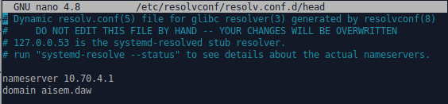

una vez echo esto solo nos queda reiniciar el equipo

## forwarder

para configurar los forwarder solo tenemos que modificar el fichero /etc/bind/named.conf.options

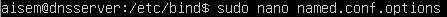

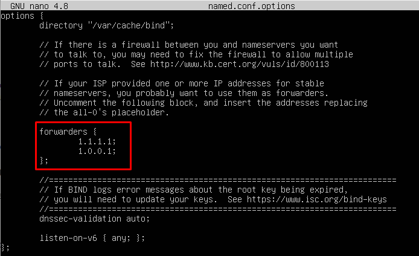

## Crear zonas 

para crear las zonas iremos al archivo /etc/named.conf.local

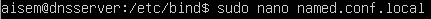

y crearemos las zonas en mi caso cree una zona directa y otra inversa

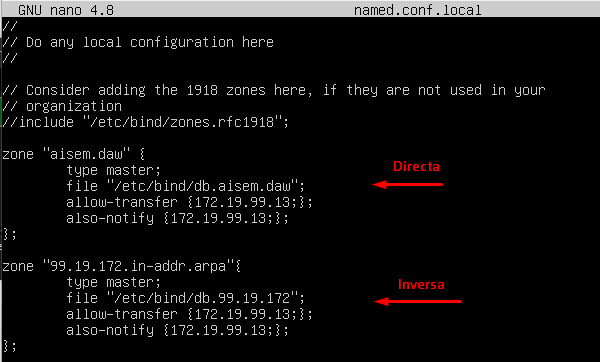

una vez echo reiniciaremos el servicio con el siguiente comando

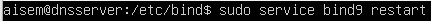

## Zona directa

para configurar nuestra zona directa lo primero que tendremos que hacer es crear nuestro fichero db.aisem.daw para ello copiaremos uno de los que están creados y le daremos el nombre de nuestra zona directa

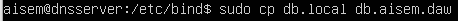

luego modificaremos el archivo y pondremos tantos equipos como tengamos en nuestra red

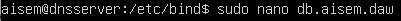

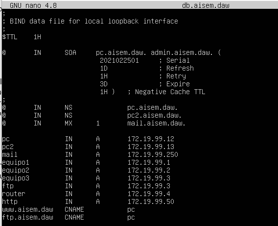

y luego reiniciaremos nuestro servicio

## Zona inversa

para crear la zona inversa haremos los mismos pasos que en la zona directa pero cambiando el nombre al fichero, luego lo modificaremos y reiniciaremos el servicio

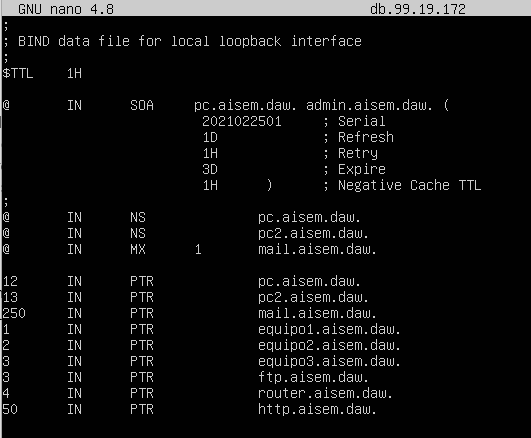

## Comprobar sintaxis

para comprobar la sintaxis puedes usar estos dos comandos

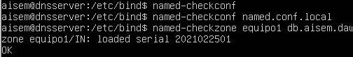

## Pruebas

**Servidor**

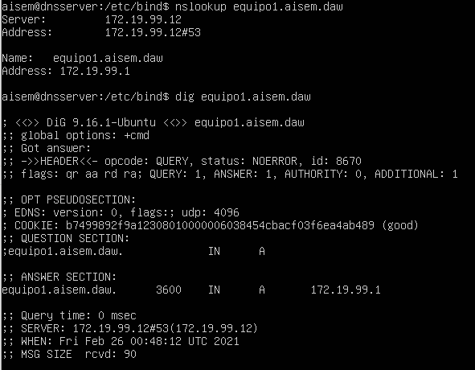

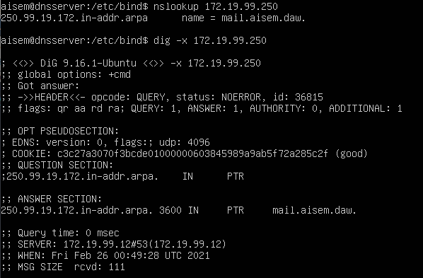

**Cliente**

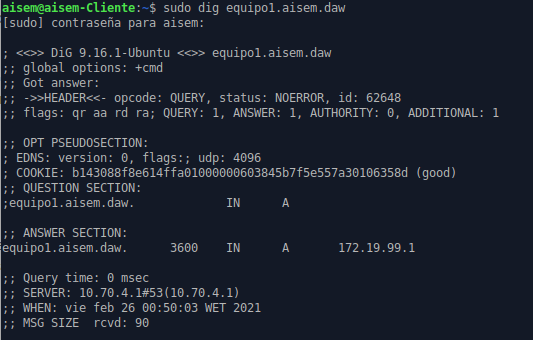

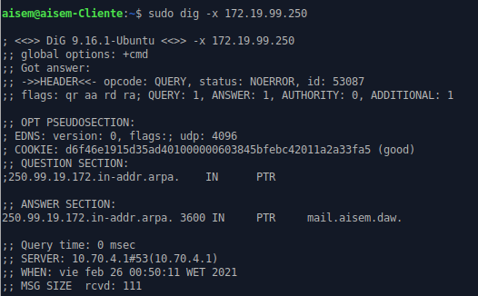

## Servidor esclavo

para crear un servidor esclavo, haremos igual que en el server anterior, es decir le daremos una ip fija e instalaremos bind9,

una vez echo esto modificaremos el fichero /etc/bind/named.conf.local y lo dejaremos de la siguiente forma

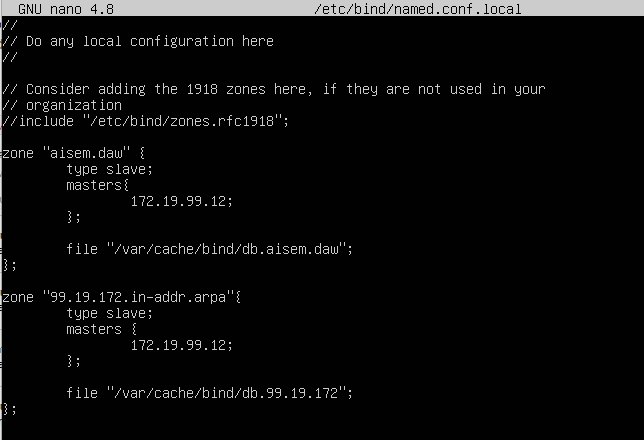

y en el servidor maestro añadiremos estas líneas

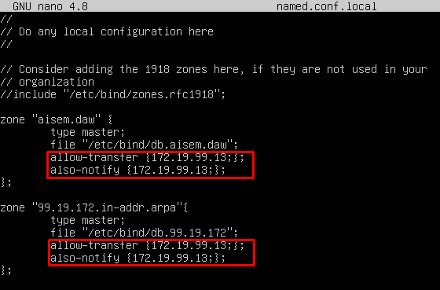

luego reiniciamos el servicio y ya estará listo nuestro server esclavo

aquí una prueba del funcionamiento

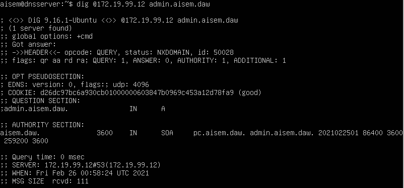

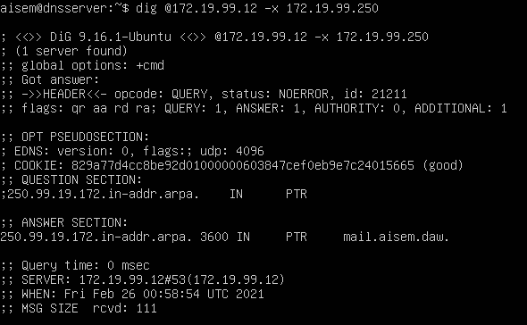

















