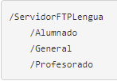
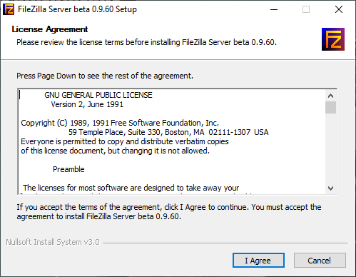
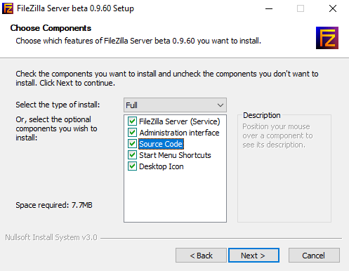
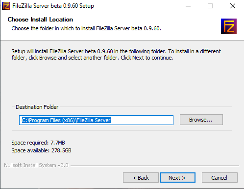
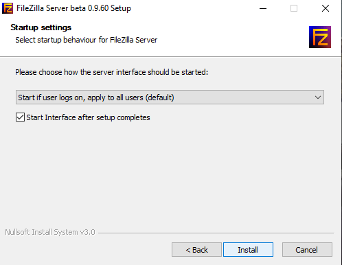
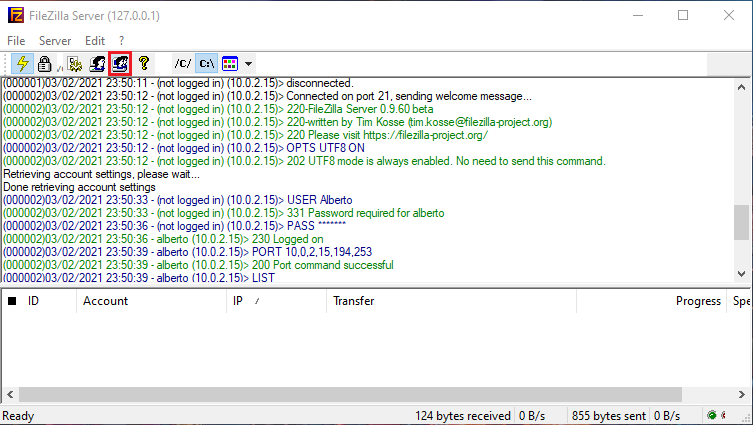
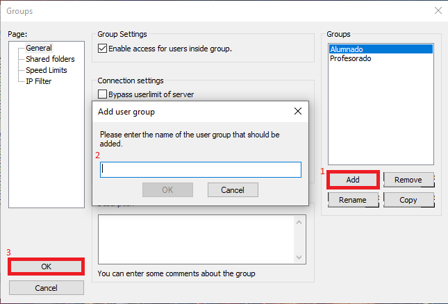
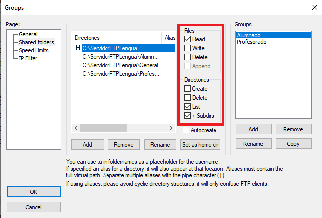
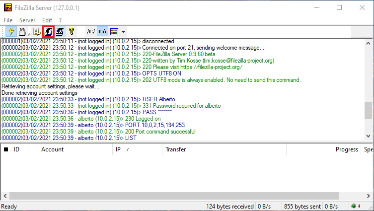
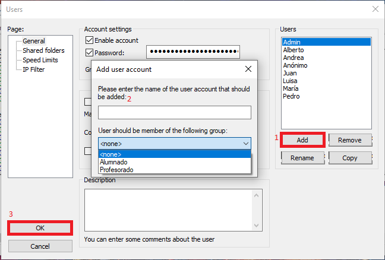


# CONFIGURACIÓN DEL SERVIDOR

## crear carpetas

crearemos las siguientes carpetas



## Instalar FileZilla

Descargamos el FileZilla server y lo instalamos











## Crear Grupos 

para crear los grupos vamos a las opciones de grupo y le damos a add y una vez añadido lo seleccionamos y configuraremos los permisos de las carpetas a las que tendrán acceso los grupos









## Crear Usuarios

para crear a los usuarios vamos a las opciones de usuario y clicamos en add, ponemos el nombre que queramos y seleccionamos el grupo al que pertenece este usuario











