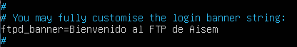
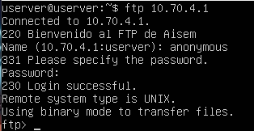
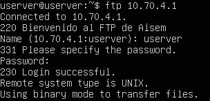
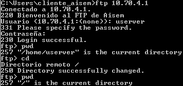
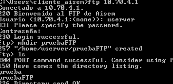
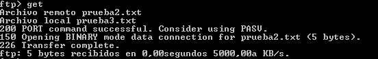
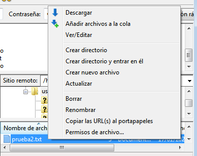
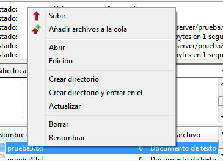

# INSTALACIÓN DE VSFTP.

1. En un Ubuntu Server instala el servicio vsftpd, explicando detalladamente los pasos de la instalación (aporta capturas de pantalla y explica su contenido).

	- para instalar vsftpd usaremos el siguiente comando:

	

	- una vez instalado iniciaremos el servidor ftp

	

2. Cambia el mensaje de bienvenida por “Bienvenido al FTP de NOMBRE DEL ALUMNO” y activa el acceso como usuario anónimo.
	
	- primero abriremos el siguiente archivo

	

	- luego buscaremos el siguiente texto y lo desmarcaremos y escribimos el texto que queramos después del igual

	

	- a continuación activaremos el usuario anónimo

	

3. Haz una conexión con usuario anónimo.

	- para hacer la conexión escribiremos ftp seguido de nuestra ip luego pondremos el nombre de usuario y dejamos la contraseña en blanco

	

4. Una vez conectado muestra el path y lista los ficheros tanto en el servidor como en el cliente. Pon archivos en diferentes carpetas dentro del servidor y realiza pruebas para descargarlos.

	

5. Intenta el acceso con un usuario local de la máquina Ubuntu. Si no puedes, cambia el parámetro para que puedas.
	
	- para ello solo debemos introducir el usuario y contraseña de nuestro usuario local

	

6. Muévete hacia el directorio padre tanto en el cliente como en el servidor. ¿Puedes hacerlo? ¿Detectas algún problema de seguridad?
	
	- para ello solo debemos usar el comando cd

	

	

7. Crea un directorio a través del FTP.
	- para ello usaremos el comando mkdir seguido del nombre de la carpeta

	

8. Sube algún archivo al servidor y baja otro.

	- para subir un archivo ponemos put le damos a enter y luego nos pedirá el archivo que queremos subir y donde queremos guardarlo

	
	
	

9. Sube múltiples archivos con un solo comando.

	- haremos lo mismo que en el ejercicio anterior pero usando el comando mput

	

10. Sal de la conexión.

	- para salir de la conexión usaremos el siguiente comando

	

# CLIENTE GRÁFICO.

1. Instala el Filezilla, sube y baja algunos archivos para ver cómo funciona.
	- primero abrimos FileZilla y ponemos los datos de nuestro servidor

	
	
	- luego seleccionamos el archivo que queremos descargar le damos click derecho y seleccionamos descargar

	

	- igual que hicimos antes seleccionamos el archivo que queremos subir, le damos click derecho y seleccionamos subir 

	

	






