# SERVIDOR FTP EN WINDOWS 2008 SERVER

## Instalar la utilidad IIS

1. Abrimos el Administrador del Servidor

	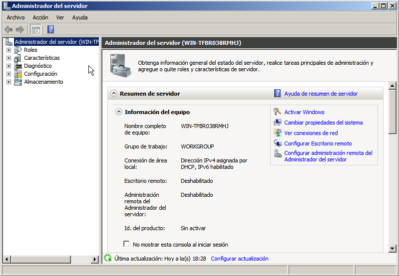

2.  a Continuación vamos a **acción/Agregar roles**

	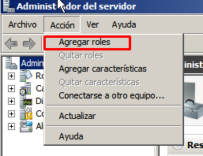


3. clicamos en siguiente y seleccionamos **Servidor web (IIS)**

	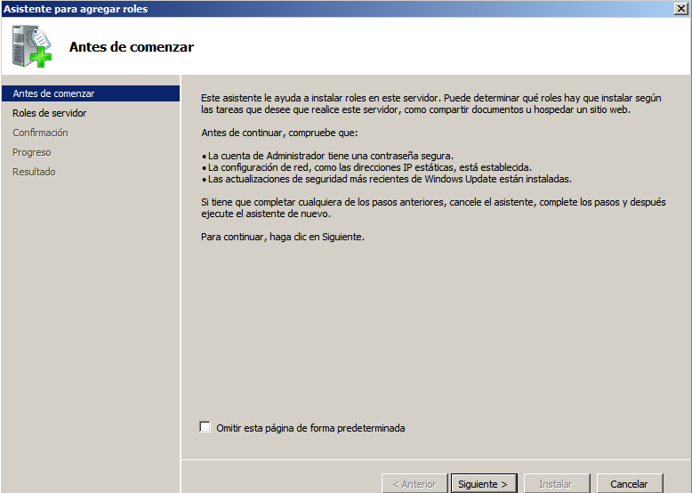
	
	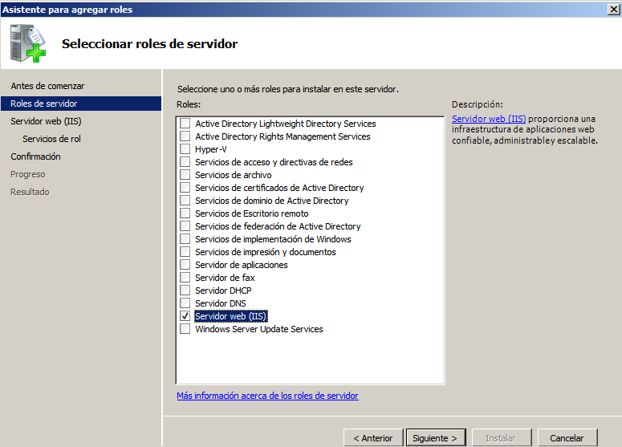

3. clicamos en siguiente y activamos las siguientes opciones

	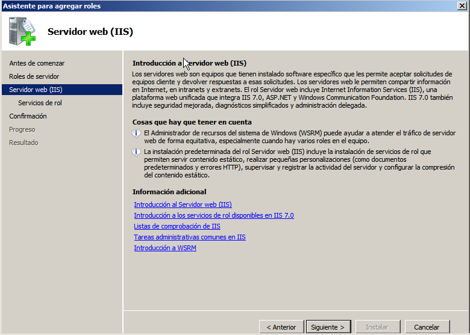

	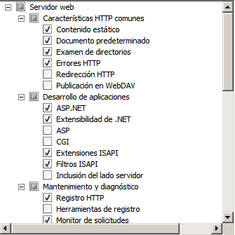

	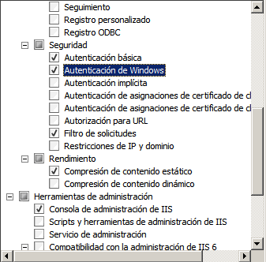

	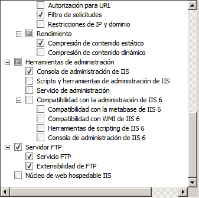

4. por ultimo le damos a instalar y ya lo tendremos instalados

	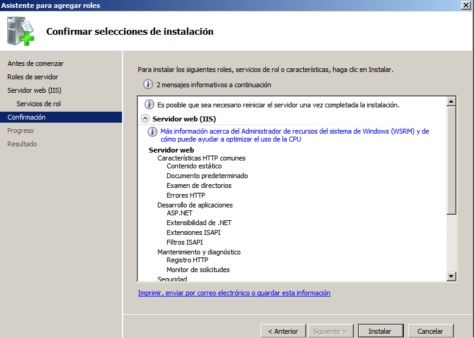

	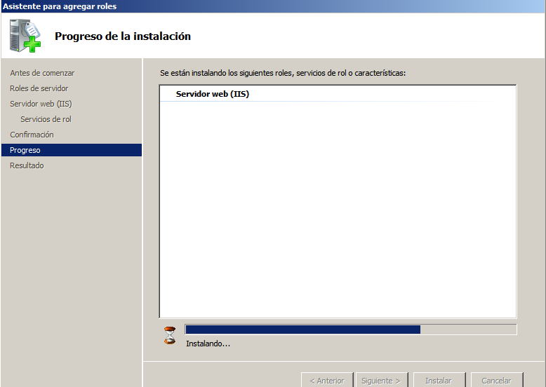

	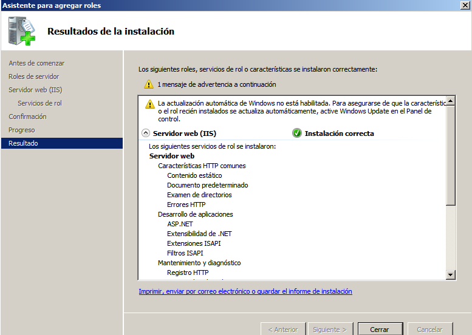

5. Para cambiar el tiempo de espera clicamos en opciones avanzada y modificamos el tiempo de espera

	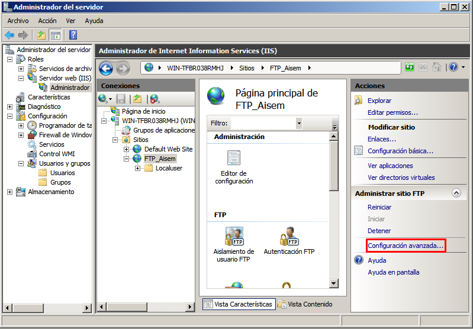

	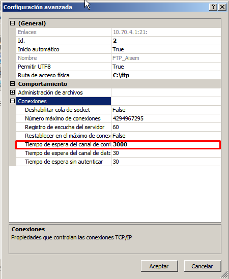

## Agregar y Configurar Servidor FTP

1. Creamos los siguientes directorios

	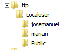

2.  vamos a **Administrador del servidor/Roles/Servidor web/Administrador** de internet y clicamos con el botón derecho del ratón y seleccionamos Agregar sitio web

	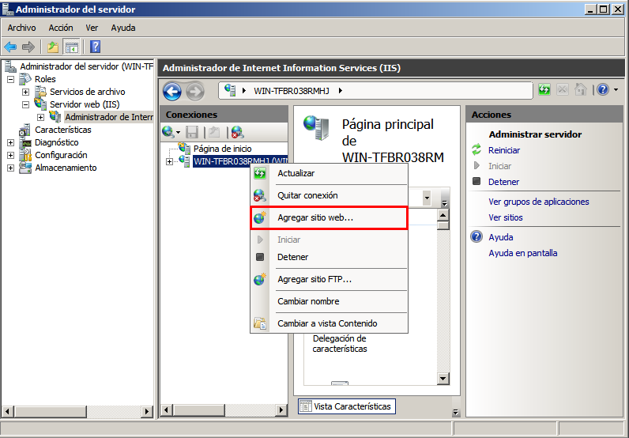

3. Elegimos el nombre que queremos darle al sitio FTP y seleccionamos la ruta de la carpeta principal de ftp

	
 
 4. Ponemos la ip del servidor y seleccionamos el puerto y la opción SSL que queramos

	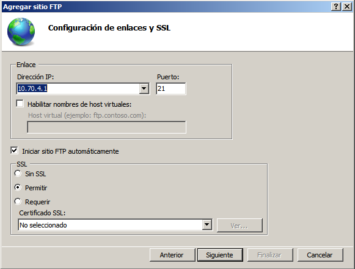

5. Seleccionamos la autenticación, Autorización y Permisos que queramos darle a nuestro servidor

	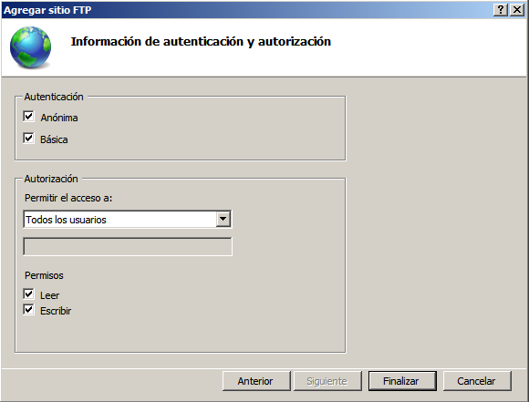

## Dar Permisos

1. seleccionamos la carpeta a la que queramos darle permisos y clicamos en editar permisos

	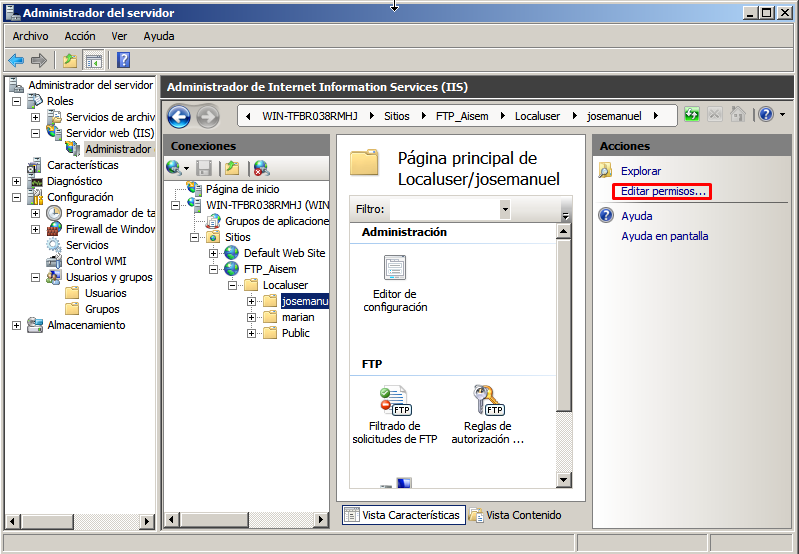

2. clicamos en editar y en agregar

	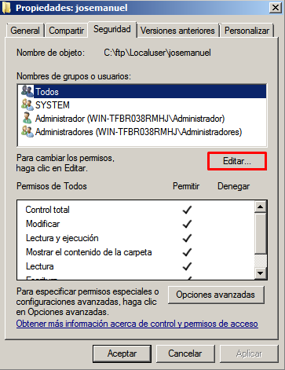

	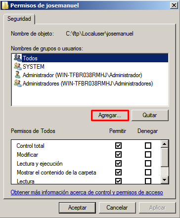

3. clicamos en opciones avanzadas

	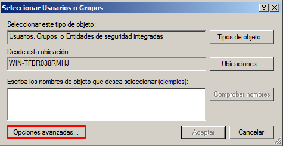

4. clicamos en buscar ahora, luego seleccionamos el usuario y clicamos en aceptar

	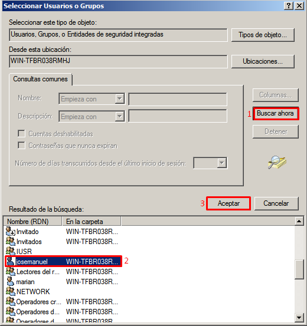

5. Elegimos los permisos que queremos darle y clicamos en aceptar

	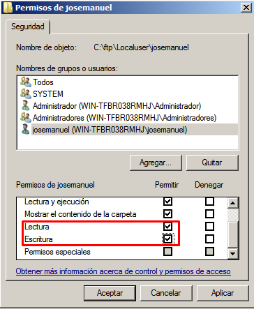

## Mensaje de bienvenida

1. vamos a la opción **Mensajes de FTP**
	
	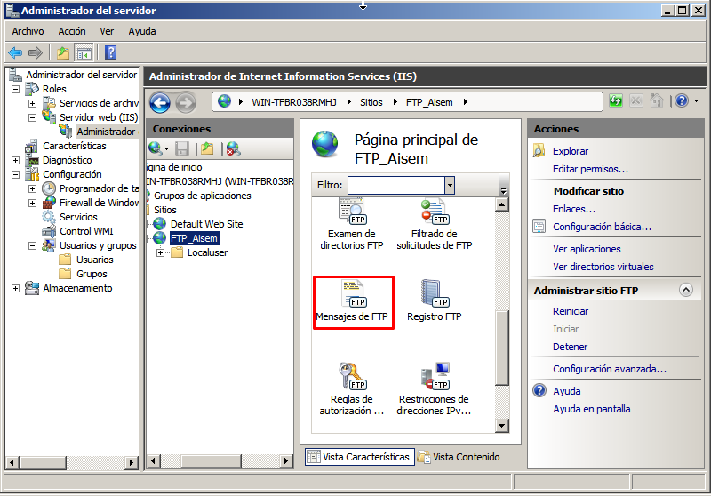

2.  Escribimos el mensaje y le damos en aplicar

	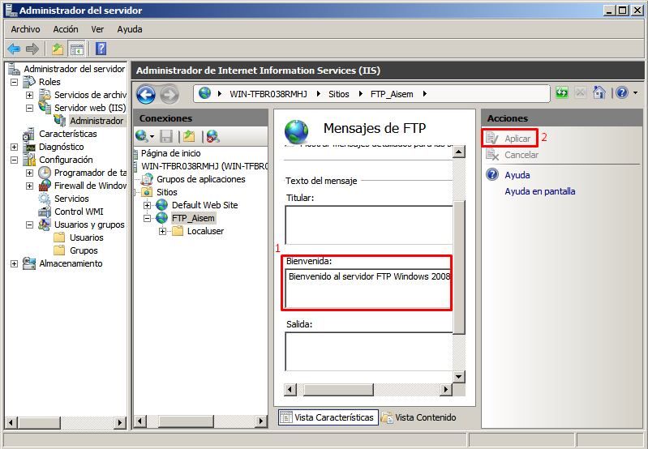











