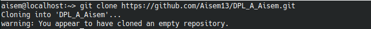
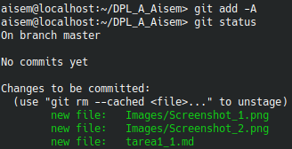
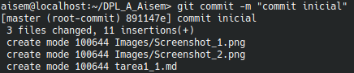
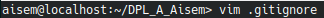
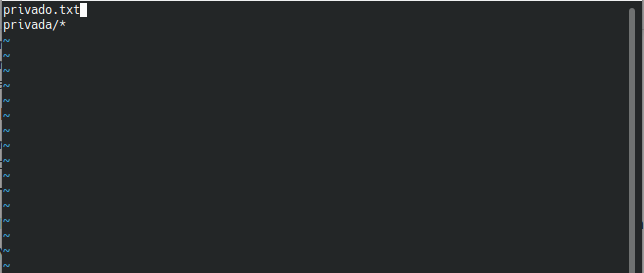

##Clonar Repositorio

para clonar un repositorio utilizaremos el siguiente comando:

si el repositorio que queresmos clonar es privado nos pedirá el usuario y la contraseña, una vez que la pongamos  se nos clonará el repositorio en nuestro equipo,en el caso de que sea publico pasará directamente a clonar el repositorio a nuestro equipo.

##Crear archivo readme

Para crear nuestro archivo readme nos iremos a nuestra carpeta y luego ejecutamos el siguiente comando

##Hacer commit inicial

Lo primero que debemos hacer pasar nuestro archivos del working Directory al Staging Area, para ello utilizaremos el siguiente comando

el siguiente paso es hacer nuestro commit

##Subir ficheros a repositorio remoto

Una vez hayamos echo el commit estaremos preparados para subir nustros archivos al repositorio remoto, solo tendremos que usar el siguiente comando

##Ignorar ficheros

Si tenemos algun fichero que queremos que git ignore solo tenemos que añadirlo al fichero .gitignore

aquí podreis comprobar como git ignora tanto el fichero como el directorio que hemos puesto en .gitignore

##Añadir ficheros repositorio local

Si queremos añadir un fichero a nuestro repositorio local lo único que tenemos que hacer es utilizar el siguiente comando

##Crear tag

Para crear un tag solo tendreis que ejecutar el siguiente codigo

ahora vamos a comprobar como se ha añadido el tag al commit  que hemos escogido

