# Trabajando con Git y MarkDown

## Clonar Repositorio

para clonar un repositorio utilizaremos el siguiente comando:

si el repositorio que queresmos clonar es privado nos pedirá el usuario y la contraseña, una vez que la pongamos  se nos clonará el repositorio en nuestro equipo,en el caso de que sea publico pasará directamente a clonar el repositorio a nuestro equipo.

## Crear archivo readme

Para crear nuestro archivo readme nos iremos a nuestra carpeta y luego ejecutamos el siguiente comando

## Hacer commit inicial

Lo primero que debemos hacer pasar nuestro archivos del working Directory al Staging Area, para ello utilizaremos el siguiente comando

el siguiente paso es hacer nuestro commit

## Subir ficheros a repositorio remoto

Una vez hayamos echo el commit estaremos preparados para subir nustros archivos al repositorio remoto, solo tendremos que usar el siguiente comando

## Ignorar ficheros

Si tenemos algun fichero que queremos que git ignore solo tenemos que añadirlo al fichero .gitignore

aquí podreis comprobar como git ignora tanto el fichero como el directorio que hemos puesto en .gitignore

## Añadir ficheros repositorio local

Si queremos añadir un fichero a nuestro repositorio local lo único que tenemos que hacer es utilizar el siguiente comando

## Crear tag

Para crear un tag solo tendreis que ejecutar el siguiente codigo

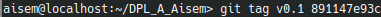

ahora vamos a comprobar como se ha añadido el tag al commit  que hemos escogido

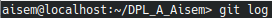

## Configuracion y Uso Github

### Poner foto perfil

para poner la foto de perfil no vamos a los ajustes y a la pestaña profile, una vez ahí clicamos en edit y elegimos la imagen que queremos poner

 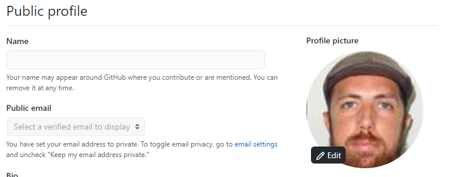
 
### doble factor de autenticación 

vamos a la pestaña account security y clicamos en el boton verde que nos pone enable Two-factor authentication

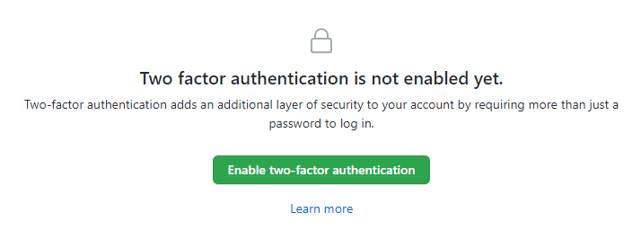
 
seguimos los pasos que nos dice y ya tendremos activada el doble factor de autenticación

### Seguir repositorio y dar estrellas

para seguir un repositorio solo tenemos que clicar en el ojo y elegir watch de este modo cada vez que se haga un cambio te lo notificará y para dar una estrella solo tendremos que clicar en la estrella

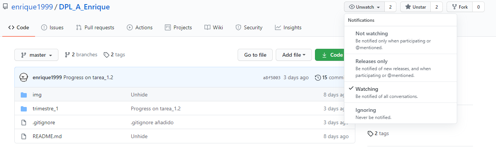

## Tabla github

| NOMBRE                            | GITHUB                         |
|-----------------------------------|--------------------------------|
| Francisco De Asís Domínguez Iceta | https://github.com/ciscoDIZ    |
| Enrique Granados Méndez           | https://github.com/enrique1999 |

# Trabajando con Git y MarkDown II

## Crear rama

Para crear una rama hemos de utilizar el siguiente código

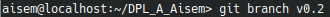

una vez creada la rama tenemos que posicionarnos en ella con él siguiente código

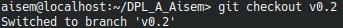

## Añadir fichero

una vez creado el fichero solo tendremos que usar el siguiente código para añadirlo

## Crear una rama remota

para crear una rama remota solo tendremos que usar este código 

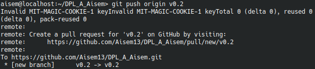

## Merge directo

para hacer un merge primero hemos de situarnos en la rama master

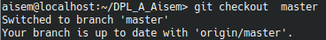

Una vez situados en la rama master procederemos a hacer un merger de las dos ramas usando en siguiente código

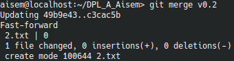

## Merge con conflicto

Vamos a crear en merge con conflicto para echo vamos a modificar en fichero 1.txt desde la ramas master y v0.2, en la rama master pondremos hola y en v0.2 pondremos adios en el mismo fichero

### rama master

modificando fichero 1.txt

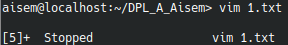

añadiendo el fichero y haciendo un comit

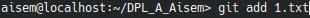

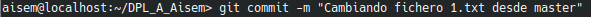

### rama v0.2

modificando fichero 1.txt

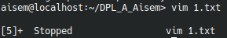

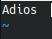

añadiendo el fichero y haciendo un comit

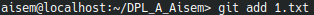

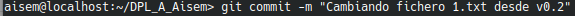

una vez echo esto aremos el merge

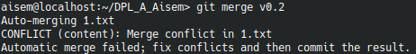

## Listar ramas

para listar ramas con merge usamos en siguiete código

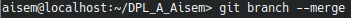

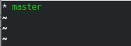

y para las ramas sin merge este otro

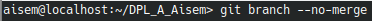

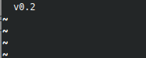

## Arreglar conflico merge

Lo primero que tenemos que hacer es mirar las diferencias que hay, para ello haremos lo siguiente

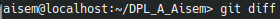

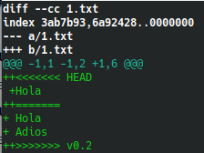

una vez vista la diferencia hay dos opciones o añadir la palabra adios en master o quitar esa palabra en v0.2, en este caso haremos la primera opción

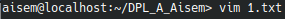

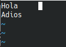

luego lo añadimos y hacemos el commit

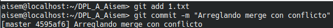

y ya estamos listo para hacer el merge

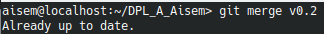

## Borrar la rama 

antes de borrar la rama vamos a crear un tag

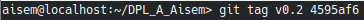

ahora procedemos a borra la rama

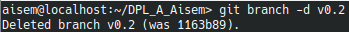

## Listar cambios

para ver los cambios solo tendremos que usar el siguiente código

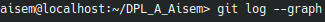

y esto es lo que veremos

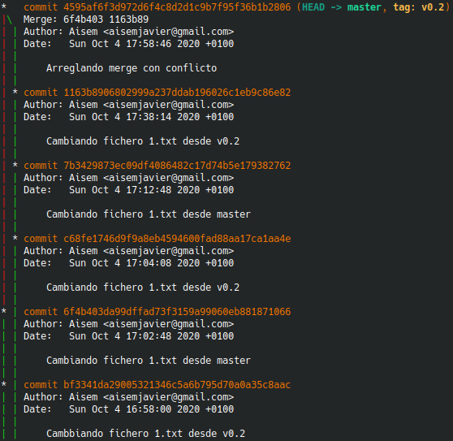