
# Instalación del servidor web Nginx en Ubuntu Server

## Instalar Nginx

Para realizar la instalación primero actualizamos los paquetes y luego instalamos Nginx:

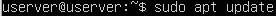



## Configurar el firewall.

primeros enumeramos los perfiles **ufw** con el siguiente comando:

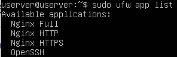

Se recomienda habilitar el perfil más restrictivo, que de todos modos permitirá el tráfico que configuró. Debido a que en esta práctica aún no configuramos SSL para nuestro servidor, solo deberemos permitir el tráfico en el puerto 80, para ello utilizaremos el siguiente comando:

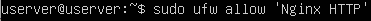

verificaremos el cambio mediante el siguiente comando:

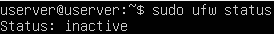

Es posible que obtengamos como respuesta que el firewall no está activo, para solucionarlo activaremos el firewall:

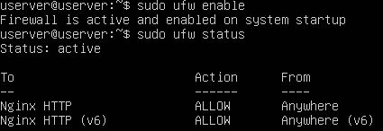

## Comprobar el estado del servidor web

Para saber si se encuentra en ejecución el servicio escribiendo lo siguiente:

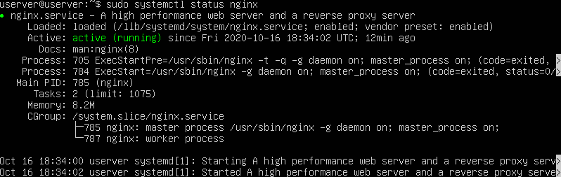

Otra forma de comprobar que el servidor web está funcionando es solicitar una página de Nginx, para ello iremos a nuestra maquina con Windows abriremos nuestro navegador y escribiremos la **ip** de nuestro servidor apache

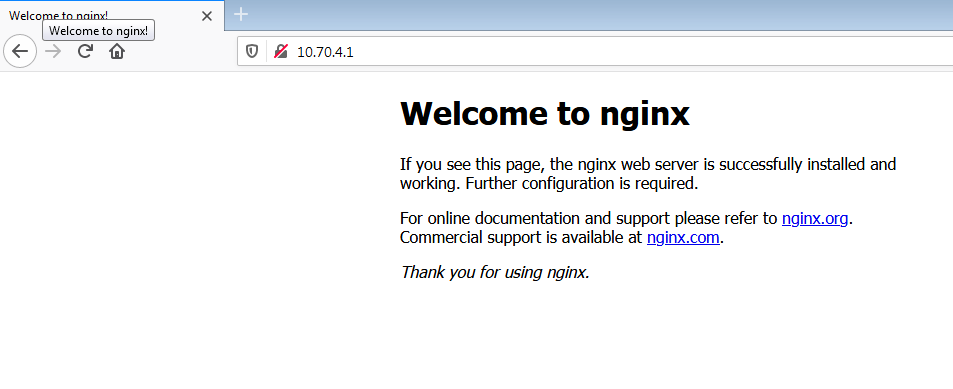

## Administrar el proceso de Nginx

Para detener su servidor web, escriba lo siguiente:

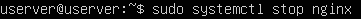

Para iniciar el servidor web cuando no esté activo, escriba lo siguiente:

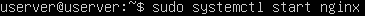

Para detener y luego iniciar el servicio de nuevo, escriba lo siguiente:



Si solo realiza cambios de configuración, Nginx a menudo puede recargarse sin cerrar conexiones. Para hacerlo, utilice este comando:



Por defecto, Nginx está configurado para iniciarse automáticamente cuando el servidor (Ubuntu) lo hace. Si no es lo que quiere, deshabilite este comportamiento escribiendo lo siguiente:

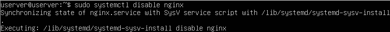

Para volver a habilitar el servicio de modo que se cargue en el inicio, escriba lo siguiente:

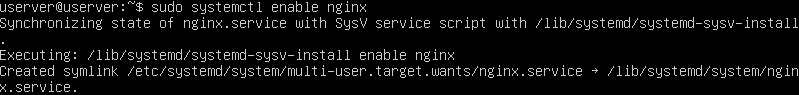


















