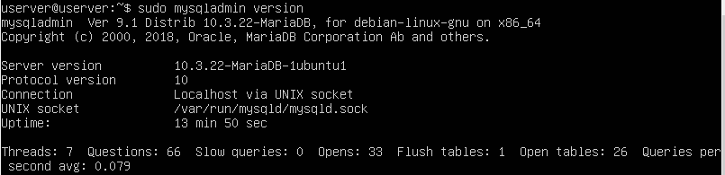

# Instalación de LAMP en Ubuntu Server

## Instalación del servidor de base de datos MaríaDB

Escribe el siguiente comando para realizar la instalación:

**sudo apt install mariadb-server mariadb-client**

el servidor MariaDB debe ejecutarse automáticamente



Para permitir que MariaDB se inicie automáticamente en el momento del arranque, debemos ejecutar:

**sudo systemctl enable mariadb**

Verificaremos la versión del servidor mariadb instalado:



Ejecutamos un script de seguridad posterior a la instalación, por medio del siguiente comando:

**sudo MySQL\_secure_installation**

Cuando nos solicite que escribamos la contraseña root de **MariaDB, pulsa Intro ya que la contraseña root aún no está configurada**. Después escribe tu contraseña de root para el servidor MariaDB.

A continuación podemos pulsar **Intro** para responder todas las preguntas restantes





Prueba el acceso a la base de datos con la nueva contraseña.



Crea un nuevo usuario en la base de datos llamado **developer** con la contraseña **5t6y7u8i**.



## Instalación de la última versión de PHP.

Vamos a escribir el siguiente comando para instalar PHP y algunos módulos PHP comunes:

**sudo apt install php7.4 libapache2-mod-php7.4 php7.4-mysql php-common php7.4-cli php7.4-common php7.4-json php7.4-opcache php7.4-readline**

Ahora tendremos que activar el módulo Apache php8 y reiniciar el servidor web Apache.

**sudo a2enmod php7.4**

**sudo systemctl restart apache2**

Verificamos la versión de PHP instalada mediante el comando:

**php --versión**

Para probar los scripts PHP con el servidor Apache, necesitamos crear un archivo info.php en el directorio raíz:

**sudo vim /var/www/html/info.php**

Dentro del archivo vamos a pegar el siguiente código PHP:

**<?php phpinfo(); ?>**

Una vez guardado el archivo, ahora en la barra de direcciones del navegador tendremos que escribir **dirección-ip/info.php**.



## Ejecutando código PHP en Apache.

Tenemos dos formas de ejecutar código PHP con el servidor web Apache. Con el módulo PHP Apache y con PHP-FPM. En los pasos anteriores, el módulo Apache PHP7.4 se usa para manejar el código PHP. Esto generalmente está bien, pero en algunos casos debemos ejecutar código PHP con PHP-FPM. 

Para hacerlo, tendremos que deshabilitar el módulo Apache PHP8:

**sudo a2dismod php7.4**

Posteriormente instalamos PHP-FPM:

**sudo apt install php7.4-fpm**

Continuamos habilitando proxy_fcgi y el módulo setenvif:

**sudo a2enmod proxy_fcgi setenvif**

El siguiente paso será habilitar el archivo de configuración **/etc/apache2/conf-available/php7.4-fpm.conf**:

**sudo a2enconf php7.4-fpm**

Después debemos reiniciar Apache:

**sudo systemctl restart apache2**

Ahora, si actualizas la página info.php en el navegador, encontrarás que la API del servidor ha cambiado de Apache 2.0 Handler a FPM/FastCGI











