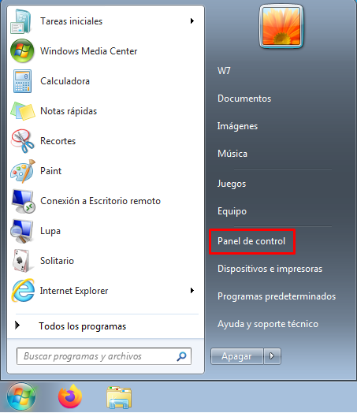
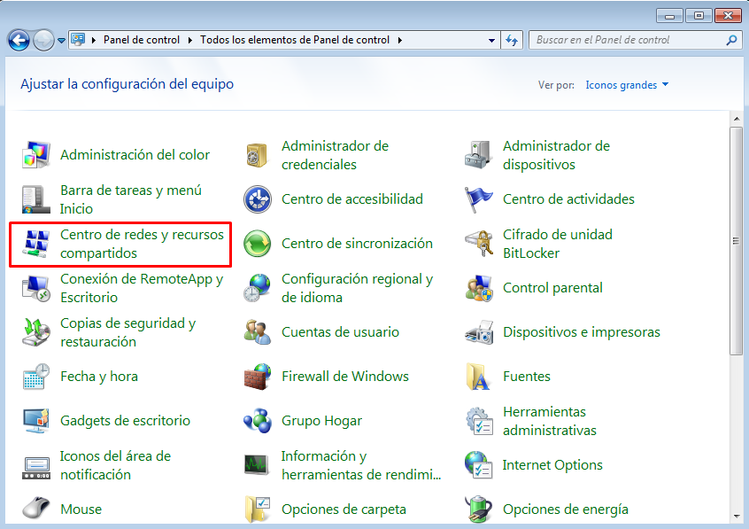
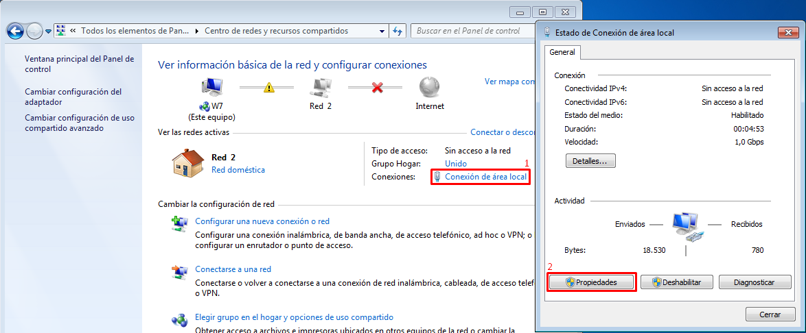
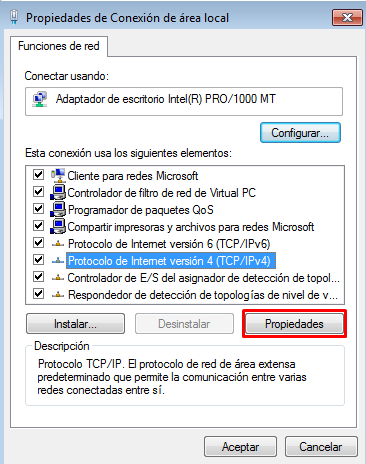
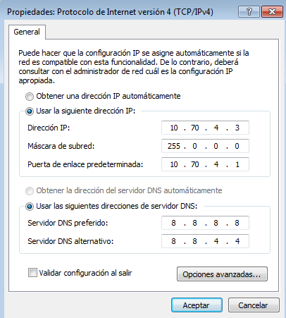
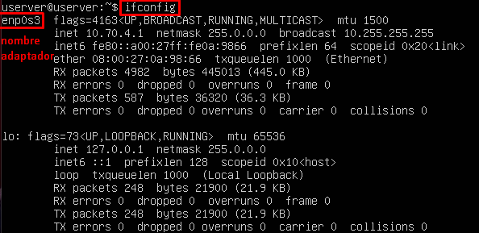
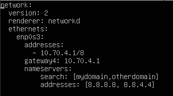
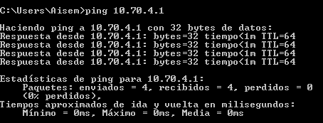
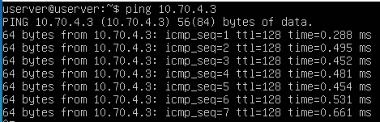

# Red TCP-IP

## Configuración del adaptador de red en Windows 7

Para configurar el adaptador de red en Windows 7 tenemos que seguir los siguientes pasos: 

Menú Inicio -> Panel de control 



Centro de Redes y recursos compartidos 



Conexión de área local -> Propiedades 



Protocolo de Internet versión 4





## Configuración del adaptador de red en Ubuntu Server

Para configurar el adaptador de red en Ubuntu Server primero tendremos que usar el comando **ifconfig** para saber cual es el nombre de nuestro adaptador



luego tendremos que editar el fichero de configuración que se encuentra en **/etc/netplan/**





por ultimo usaremos el comando **netplan try**



## Comprobación de la configuración y de funcionamiento

para comprobar si todo funciona bien solo tendremos que hacer un ping de una maquina a otra 










  




