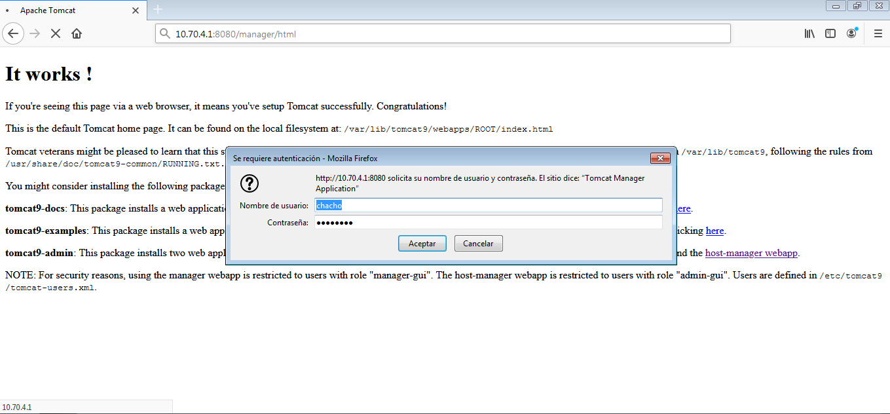

# Instalación de Tomcat en Ubuntu server

## Instalar Tomcat 9

Vamos a instalar Tomcat 9, para ello actualizaremos las listas de paquetes

**sudo apt update**

Luego instalaremos tomcat

**sudo apt install -y tomcat9 tomcat9-admin**

## Configurar el firewall

tenemos que añadir la siguiente regla

**sudo ufw allow 8080/tcp**

## Configuración de Tomcat 9

### Puerto de conexion

Si queremos cambiar el puerto de escucha tendremos que editar el fichero

**sudo nano /etc/tomcat9/server.xml**

buscaremos la siguiente directiva **Conector**
~~~
    <Connector port="8080" protocol="HTTP/1.1"
               connectionTimeout="20000"
               redirectPort="8443" />
~~~

basta con sustituir el valor de port por el puerto que queramos

### Usuarios de Tomcat

Para crear los usuarios modificaremos el siguiente archivo

**sudo nano /etc/tomcat9/tomcat-users.xml**

Antes del cierre del bloque añadiremos lo siguiente
~~~    
        <user username="chacho" password="XXXXXXXX" roles="admin-gui,manager-gui"/>
~~~
        
### Acceso remoto a las aplicaciones

tendremos que modificar los siguientes archivos

**sudo nano /usr/share/tomcat9-admin/manager/META-INF/context.xml**

**sudo nano /usr/share/tomcat9-admin/host-manager/META-INF/context.xml**

y desactivamos la siguiente directiva

~~~
<!--
  <Valve className="org.apache.catalina.valves.RemoteAddrValve"
         allow="127\.\d+\.\d+\.\d+|::1|0:0:0:0:0:0:0:1" />
-->

~~~
### Aplicar los cambios a la configuración

para aplicar los cambios habrá que reiniciar el servicio Tomcat 9 para ello usaremos el siguiente código

**sudo systemctl restart tomcat9**

## Acceder a Tomcat 9

accedermos a tomcat desde un navegador para ello iremos a nuestro navegador e introduciremos la siguiente url

**http://ip_del_server:8080**



## Aplicación manager 

para ir al gestor de aplicaiones web tendremos que añadir a la anterior url

**/manager/html**

nos pedirá la contraseña y el usuario que habíamos creado antes



a continuación se nos mostrará el **Gestor de Aplicaiones Web de Tomcat**



## Aplicación Host Manager

Igual que en el punto anterior para acceder al **Gestor de Máquina Virtual de Tomcat** pondremos al final de la url anterior 

**/host-manager**

tras autenticarnos podremos acceder a la aplicación



## Desplegando aplicaiones sobre Tomcat 9 en Ubuntu

vamos al **Gestor de Aplicaciones Web de Tomcat** y nos desplazamos hasta la sección **Desplegar**, seleccionamos el archivo **.war** que queremos desplegar y le damos al botom **Desplegar** y veremos listada nuestra aplicación en el **Gestor de Aplicaciones**



para probar la pagina solo tendremos que seguir el enlace que aparece en la misma página de aplicaciones



## Cambiar tamaño máximo admitido de los archivo .war

tendremos que modificar el siguiente archivo

**sudo nano /usr/share/tomcat9-admin/manager/WEB-INF/web.xml**

y modificaremos el bloque **multipart-config**

~~~
 <multipart-config>
      <!-- 50MB max -->
      <max-file-size>52428800</max-file-size>
      <max-request-size>52428800</max-request-size>
      <file-size-threshold>0</file-size-threshold>
    </multipart-config>
~~~

y lo modificamos 

~~~
<multipart-config>
      <!-- 100MB max -->
      <max-file-size>104857600</max-file-size>
      <max-request-size>104857600</max-request-size>
      <file-size-threshold>0</file-size-threshold>
    </multipart-config>
~~~

