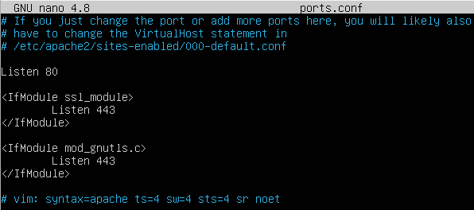
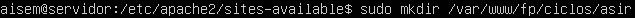

# REVISIÓN DE LA CONFIGURACIÓN BÁSICA DE APACHE
## Ficheros de configuración.
- Inicia sesión con un usuario con privilegios de administrador en servidor_nombre

    

- Abre un terminal y accede al directorio **/etc/apache2**.

    
	
    

- Abre el fichero **/etc/apache2/apache2.conf** y analiza su configuración. Observa que incluye con la directiva include a otros ficheros y directorios

    

    

    

    

    

    

    

    

    **apache2.conf** es el archivo de configuración principal (este archivo). Junta las piezas al incluir todos los archivos de configuración restantes al iniciar el servidor web.

    **ports.conf** siempre se incluye desde el archivo de configuración principal. Se supone que determina los puertos de escucha para las conexiones entrantes que se pueden personalizar en cualquier momento.

    Los archivos de configuración en los directorios **mods-enabled/**, **conf-enabled/** y **sites-enabled/** contienen fragmentos de configuración particulares que administran módulos, fragmentos de configuración global o configuraciones de host virtual, respectivamente.

	1. Servidor virtual por defecto.
        - Accede al directorio **/etc/apache2/sites-available** y comprueba que está creado archivo **000-default.conf** que contiene la configuración del servidor virtual por defecto.

            Para acceder al directorio usamos el comando **cd + la ruta de la carpeta** y usamos el comando **ls** ver el contenido de la carpeta

            

        - Accede a /etc/apache2/sites-enabled y comprueba que existe el fichero 000-default.conf que es un enlace simbólico a000-default.conf pero de /etc/apache2/sites-available.

            Para acceder al directorio usamos el comando **cd + la ruta de la carpeta** y usamos el comando **ls** ver el contenido de la carpeta

            

    2. Directivas
        - Cosulta el fichero **/etc/apache2/apache2.conf** y comprueba cuál es el valor de las siguientes directivas, explicando que función tiene cada una de ellas.

        - ServerRoot

             

            Esta directiva define el directorio donde se ubica toda la información de configuración y registro que necesita el servidor para su correcto funcionamiento

        - Timeout 

            

            Define, en segundos, el tiempo que el servidor esperará por recibir y transmitir durante la comunicación. Timeout está configurado por defecto a 300 segundos, lo cual es apropiado para la mayoría de las situaciones

        - KeepAlive 

            

            Define si las conexiones persistentes están activadas. Por defecto están activadas

        - MaxKeepAliveRequests

            

            Establece el número máximo de peticiones permitidas por cada conexión persistente. Por defecto está establecido como 100

        - KeepAliveTimeout 

             

            Establece el número de segundos que el servidor esperará tras haber dado servicio a una petición, antes de cerrar la conexión. Por defecto 5 segundos

        - User y Group 

            

            User: define el usuario que ejecuta los procesos de Apache2.
           
            Group: define el grupo al que corresponde el usuario

        - ErrorLog

            

            La directiva ErrorLog establece el nombre del archivo en el que el servidor registrará cualquier error que encuentre.

        - Consulta la documentación de Apache y responde entonces a las siguientes preguntas.

            - ¿Se permiten conexiones persistentes. ¿Qué directiva define este comportamiento?

                si, Keep-Alive 

            - ¿Cuál es el fichero de errores?. ¿Qué directiva lo define?.
           
                error.log, ErrorLog

        - Consulta el fichero **/etc/apache2/ports.conf**, y comprueba cuál es el puerto en el que escucha las peticiones Apache. ¿En qué puerto escuchará también si se habilita el módulo modssl?. 

            

            El puerto por el que escucha es el 80 y si activas el ssl también escuchará el 443

       - Consulta el fichero **/etc/apache2/sites-avalaible/000-default.conf** observa y comenta la función de cada uno de los siguientes puntos:

           - Dentro de la directiva `<VirtualHost>` ... `</VirtualHost>` se define el comportamiento del servidor virtual por defecto.

	            `<VirtualHost>` y `</VirtualHost>` se utilizan para encerrar un grupo de directivas que se aplicarán solo a un host virtual en particular. Se puede utilizar cualquier directiva que esté permitida en un contexto de host virtual. Cuando el servidor recibe una solicitud de un documento en un host virtual en particular, utiliza las directivas de configuración incluidas en la sección  `<VirtualHost>`

           - El valor de la directiva DocumentRoot es **/var/www/html**.

                 esta directiva establece el directorio desde el cual httpd servirá archivos.

           - El valor de la directiva ErrorLog.

                ${APACHE_LOG_DIR}/error.log

        - Consulta el fichero **/etc/apache2/apache2.conf** observa y comenta la función de cada uno de los siguientes puntos:

            - La directiva contenedora  `<Directory>` ....  `</Directory>` que se utiliza para determinar cómo Apache sirve el contenido del directorio **/var/www.**

                `<Directory>` y  `</Directory>` se utilizan para encerrar un grupo de directivas que se aplicarán solo al directorio nombrado, subdirectorios de ese directorio y los archivos dentro de los directorios respectivos.

            - Realiza una captura de ese fichero y señala en él la directiva que se sigue.

                

# CONFIGURACIÓN BÁSICA DE APACHE

1. Para ello vamos a crear un archivo de configuración fp.conf que hará referencia a la web alojada en la ruta **/var/www/fp/**.

    para crear el fichero usaremos el siguiente comando

    

2. Crear los siguientes directorios y archivos:

    -  `/var/www/fp/index.html`

        

    -  `/var/www/fp/ciclos/listado.html`

        

    -  `/var/www/fp/ciclos/examenes/`

        

    -  `/var/www/fp/ciclos/asir/asir.html`

        

    -  `/var/www/fp/ciclos/daw/daw.html`

        

    -  `/var/www/fp/ciclos/dam/dam.html`

        

3. Configura la máquina cliente_nombre de forma que podamos acceder al contenido de nuestra web al poner en el navegador **www.fpdaw.org** y **fpdaw.org**. Explica como lo has echo incluyendo capturas de pantalla.

    - tendremos que modificar el archivo **host** que está en **C:\Windows\System32\drivers\etc**, tendremos que escribir la ip de la maquina a la que nos queremos conectar y la url que queremos darle a esa ip

        

4. Ficheros a servir por defecto (Directory Index).

    - Desde cliente_nombre abre un navegador y establece una conexión a http://10.70.XX.11

        

    - No se ha solicitado ningún recurso en concreto por lo que el servidor ha enviado el index.html (valor en la directiva DirectoryIndex por defecto). 

    - Renombra el fichero /var/www/fp/index.html a /var/www/fp/indice.html

        

    - Desde cliente_nombre abre un navegador y establece una conexión a http://10.70.XX.11. ¿Qué ocurre ahora? ¿Ha cambiado lo que envía el servidor?. 

        

        no ha ocurrido nada, sigue mandando lo mismo

    - Edita el fichero /etc/apache2/apache2.conf y añade la siguiente directiva: DirectoryIndex listado.html en la la sección<Directory /var/www>. Explica que conseguimos al hacer esta modificación

        

    - Desde cliente_nombre abre un navegador y establece una conexión al servidor de nuevo. ¿Ha cambiado el fichero de carga?.

        

5. Páginas de error personalizadas.

    - Configura el servidor para que cuando retorne el código de error 404 (página no encontrada) envíe el texto Página no encontrada en el servidor.

        Para poner un mensaje de error personalizado, lo que tendremos que hacer es ir a nuestro archivo de configuración y añadir la siguiente directiva

        

        - Reinicia el servidor. Desde el cliente_nombre establece una conexión a **http://www.fpdaw.org/noexiste.html** y muestra qué te aparece en la pantalla.

        

6. Redirecciones.

    - Configura el servidor para que al entrar a **http://www.fpdaw.org/ciclos** haga una redirección automática hacia **http://www.fpdaw.org/dam** mostrando la página web correspondiente a DAM. 

        Para hacer la redirección usaremos la siguiente directiva

        

7. Alias.

    - Crea un alias de forma que forma que al entrar en **http://www.fpdaw.org/logos** muestre el contenido de los logotipos alojados en la **ruta/home/usuarios/Documentos**

        Para crear el alias usaremos la siguiente directiva

        

8. Autenticación

   - Configura el servidor creando dos grupos de usuarios suiguientes: 
 
       - alumnos :formado por alumno1 y alumno2 

       - profesores. formado por profesor1 y profesor2

       - Los profesores deben poder acceder a todo el site, mientras que los alumnos tienen el acceso restringido a la carpeta **/fp/ciclos/exámenes**.

    - Primero tendremos que usar la siguiente directiva en el archivo de configuración

         

    - Luego crearemos los usuarios y los añadimos a los grupos

         

         

         

         

   - por ultimo activamos el modulo 

         

9. Configuración de HTTPS

    - Configura el uso de HTTPS en el servidor web. Explica detalladamente todo el proceso aportando capturas de pantalla.

        - Generamos el certificado autofirmado: openssl req -x509 -nodes -days 365 -newkey rsa:2048 -keyout fpdaw.key -out fpdaw.crt

           

       - El certificado lo dejamos en /etc/apache2/sites-available

       - Activamos el módulo ssl: a2enmod ssl

            

       - Copiamos el fichero de "ejemplo" para ssl

            

       - Editamos el fichero del sitio virtual. Añadimos el ServerName y modificamos el DocumentRoot 

            

       - Modificamos las líneas que especifican los ficheros usados por el certificado

            

      - Y ya estará funcionando

            

            

            

    - Redirecciona todo el tráfico HTTP hacia HTTPS, de forma que al conectar con **http://www.fpdaw.org** nos redireccione hacia **https://www.fpdaw.org**.

             


























